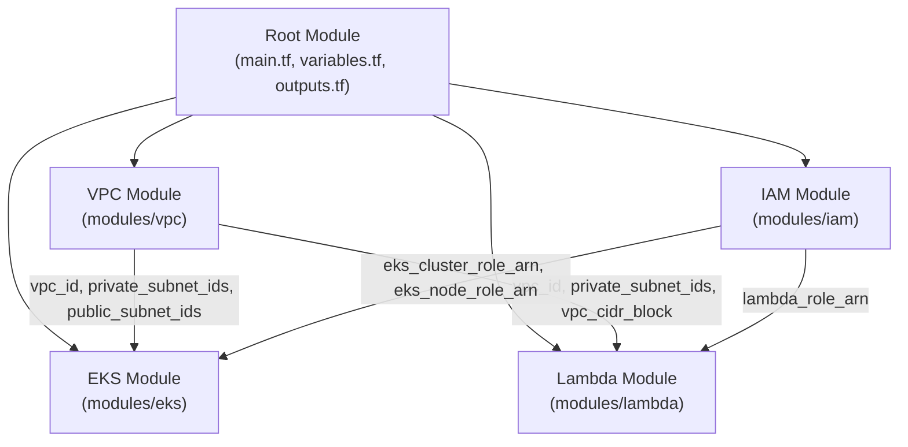
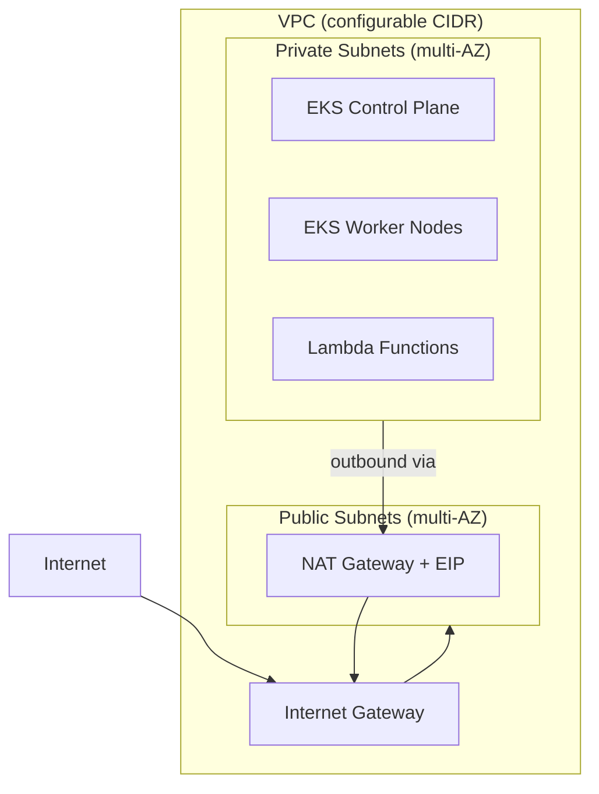

# Design Document: AWS VPC Infrastructure

## Overview

This design describes a modular Terraform infrastructure-as-code solution for provisioning an AWS VPC that hosts private resources including EKS clusters and Lambda functions. The solution is organized into four Terraform modules — VPC, EKS, Lambda, and IAM — each encapsulating a distinct concern. A root module composes these together, exposing parameterized variables and outputs so the configuration can be reused across environments without source modification.

The architecture follows AWS Well-Architected Framework networking best practices: public subnets for NAT gateways and load balancers, private subnets for compute workloads, least-privilege IAM, and restrictive security groups.

## Architecture

The solution uses a layered module architecture where a root Terraform configuration composes four child modules. Dependencies flow downward: the VPC module produces networking resources consumed by EKS, Lambda, and IAM modules.



### Network Topology



### File Structure

```
.
├── main.tf                  # Root module composition
├── variables.tf             # Root input variables with defaults
├── outputs.tf               # Root output values
├── providers.tf             # Provider and backend configuration
├── README.md                # Usage documentation
├── modules/
│   ├── vpc/
│   │   ├── main.tf          # VPC, subnets, IGW, NAT, route tables
│   │   ├── variables.tf     # VPC module inputs
│   │   └── outputs.tf       # VPC module outputs
│   ├── iam/
│   │   ├── main.tf          # IAM roles and policy attachments
│   │   ├── variables.tf     # IAM module inputs
│   │   └── outputs.tf       # IAM module outputs (role ARNs)
│   ├── eks/
│   │   ├── main.tf          # EKS cluster, node group, security groups
│   │   ├── variables.tf     # EKS module inputs
│   │   └── outputs.tf       # EKS module outputs
│   └── lambda/
│       ├── main.tf          # Lambda function, security group
│       ├── variables.tf     # Lambda module inputs
│       └── outputs.tf       # Lambda module outputs
```


## Components and Interfaces

### VPC Module (`modules/vpc`)

Responsible for all networking resources: VPC, subnets, internet gateway, NAT gateway, route tables, and the default security group.

**Inputs:**

| Variable | Type | Description | Default |
|---|---|---|---|
| `vpc_cidr_block` | `string` | CIDR block for the VPC | `"10.0.0.0/16"` |
| `availability_zones` | `list(string)` | AZs for subnet placement | `[]` (auto-detect) |
| `private_subnet_cidrs` | `list(string)` | CIDR blocks for private subnets | Computed from VPC CIDR |
| `public_subnet_cidrs` | `list(string)` | CIDR blocks for public subnets | Computed from VPC CIDR |
| `enable_dns_support` | `bool` | Enable DNS support on VPC | `true` |
| `enable_dns_hostnames` | `bool` | Enable DNS hostnames on VPC | `true` |
| `tags` | `map(string)` | Tags applied to all resources | `{}` |
| `cluster_name` | `string` | EKS cluster name for subnet tagging | `""` |

**Outputs:**

| Output | Type | Description |
|---|---|---|
| `vpc_id` | `string` | ID of the created VPC |
| `private_subnet_ids` | `list(string)` | IDs of private subnets |
| `public_subnet_ids` | `list(string)` | IDs of public subnets |
| `vpc_cidr_block` | `string` | The CIDR block of the VPC |
| `nat_gateway_id` | `string` | ID of the NAT gateway |
| `default_security_group_id` | `string` | ID of the default security group |

### IAM Module (`modules/iam`)

Creates IAM roles with least-privilege policies for EKS and Lambda services.

**Inputs:**

| Variable | Type | Description | Default |
|---|---|---|---|
| `tags` | `map(string)` | Tags applied to all IAM resources | `{}` |

**Outputs:**

| Output | Type | Description |
|---|---|---|
| `eks_cluster_role_arn` | `string` | ARN of the EKS cluster IAM role |
| `eks_node_role_arn` | `string` | ARN of the EKS node group IAM role |
| `lambda_role_arn` | `string` | ARN of the Lambda execution IAM role |

### EKS Module (`modules/eks`)

Provisions the EKS cluster, managed node group, and associated security groups.

**Inputs:**

| Variable | Type | Description | Default |
|---|---|---|---|
| `cluster_name` | `string` | Name of the EKS cluster | — (required) |
| `kubernetes_version` | `string` | Kubernetes version | `"1.29"` |
| `vpc_id` | `string` | VPC ID from VPC module | — (required) |
| `private_subnet_ids` | `list(string)` | Private subnet IDs for cluster and nodes | — (required) |
| `cluster_role_arn` | `string` | IAM role ARN for EKS cluster | — (required) |
| `node_role_arn` | `string` | IAM role ARN for node group | — (required) |
| `node_instance_types` | `list(string)` | EC2 instance types for worker nodes | `["t3.medium"]` |
| `node_min_size` | `number` | Minimum node count | `1` |
| `node_max_size` | `number` | Maximum node count | `3` |
| `node_desired_size` | `number` | Desired node count | `2` |
| `tags` | `map(string)` | Tags applied to all EKS resources | `{}` |

**Outputs:**

| Output | Type | Description |
|---|---|---|
| `cluster_endpoint` | `string` | EKS cluster API endpoint |
| `cluster_name` | `string` | Name of the EKS cluster |
| `cluster_security_group_id` | `string` | Security group ID for the cluster |

### Lambda Module (`modules/lambda`)

Deploys a Lambda function inside the VPC with a dedicated security group.

**Inputs:**

| Variable | Type | Description | Default |
|---|---|---|---|
| `function_name` | `string` | Name of the Lambda function | — (required) |
| `runtime` | `string` | Lambda runtime | `"python3.12"` |
| `handler` | `string` | Lambda handler | `"index.handler"` |
| `memory_size` | `number` | Memory in MB | `128` |
| `timeout` | `number` | Timeout in seconds | `30` |
| `vpc_id` | `string` | VPC ID from VPC module | — (required) |
| `private_subnet_ids` | `list(string)` | Private subnet IDs | — (required) |
| `vpc_cidr_block` | `string` | VPC CIDR for security group rules | — (required) |
| `lambda_role_arn` | `string` | IAM role ARN from IAM module | — (required) |
| `deployment_package_path` | `string` | Path to Lambda zip package | `""` |
| `tags` | `map(string)` | Tags applied to all Lambda resources | `{}` |

**Outputs:**

| Output | Type | Description |
|---|---|---|
| `function_arn` | `string` | ARN of the Lambda function |
| `function_name` | `string` | Name of the Lambda function |
| `security_group_id` | `string` | Security group ID for the Lambda function |


## Data Models

This solution does not use application-level data models. The "data" is Terraform state and AWS resource configurations. The key data structures are:

### Terraform Variable Structures

**Root variables** (defined in `variables.tf`):

```hcl
variable "aws_region" {
  type        = string
  description = "AWS region for resource deployment"
  default     = "us-east-1"
}

variable "vpc_cidr_block" {
  type        = string
  description = "CIDR block for the VPC"
  default     = "10.0.0.0/16"
}

variable "availability_zones" {
  type        = list(string)
  description = "List of availability zones"
  default     = []
}

variable "cluster_name" {
  type        = string
  description = "Name of the EKS cluster"
  default     = "main-cluster"
}

variable "kubernetes_version" {
  type        = string
  description = "Kubernetes version for EKS"
  default     = "1.29"
}

variable "node_instance_types" {
  type        = list(string)
  description = "EC2 instance types for EKS worker nodes"
  default     = ["t3.medium"]
}

variable "node_min_size" {
  type        = number
  description = "Minimum number of worker nodes"
  default     = 1
}

variable "node_max_size" {
  type        = number
  description = "Maximum number of worker nodes"
  default     = 3
}

variable "node_desired_size" {
  type        = number
  description = "Desired number of worker nodes"
  default     = 2
}

variable "lambda_function_name" {
  type        = string
  description = "Name of the Lambda function"
  default     = "vpc-lambda"
}

variable "lambda_runtime" {
  type        = string
  description = "Lambda function runtime"
  default     = "python3.12"
}

variable "lambda_handler" {
  type        = string
  description = "Lambda function handler"
  default     = "index.handler"
}

variable "lambda_memory_size" {
  type        = number
  description = "Lambda function memory in MB"
  default     = 128
}

variable "lambda_timeout" {
  type        = number
  description = "Lambda function timeout in seconds"
  default     = 30
}

variable "lambda_deployment_package_path" {
  type        = string
  description = "Path to Lambda deployment zip. Empty string creates a placeholder."
  default     = ""
}

variable "tags" {
  type        = map(string)
  description = "Tags applied to all resources"
  default     = {}
}
```

### Resource Tagging Convention

All resources receive a merged tag map combining user-provided tags with module-specific tags:

```hcl
locals {
  common_tags = merge(var.tags, {
    ManagedBy = "terraform"
    Module    = "aws-vpc-infrastructure"
  })
}
```

EKS subnets additionally receive Kubernetes discovery tags:

```hcl
# Private subnets
"kubernetes.io/role/internal-elb" = "1"
"kubernetes.io/cluster/${var.cluster_name}" = "shared"

# Public subnets
"kubernetes.io/role/elb" = "1"
"kubernetes.io/cluster/${var.cluster_name}" = "shared"
```

### Design Decisions

1. **Single NAT Gateway**: The default configuration creates one NAT gateway to minimize cost. For production HA, users can extend the module to create one per AZ.
2. **Placeholder Lambda**: When no deployment package is provided, the Lambda module creates a minimal inline handler using `archive_file` data source, satisfying requirement 4.5.
3. **Security group references over CIDRs**: Inter-resource security group rules reference security group IDs rather than CIDR blocks (requirement 7.5), enabling dynamic membership.
4. **Configurable backend**: The `providers.tf` file uses a configurable backend block, defaulting to local state but supporting S3 or other remote backends via backend config files.


## Correctness Properties

*A property is a characteristic or behavior that should hold true across all valid executions of a system — essentially, a formal statement about what the system should do. Properties serve as the bridge between human-readable specifications and machine-verifiable correctness guarantees.*

### Property 1: VPC CIDR pass-through

*For any* valid CIDR block string provided as the `vpc_cidr_block` variable, the generated Terraform plan SHALL contain a VPC resource whose `cidr_block` attribute equals the input value.

**Validates: Requirements 1.1**

### Property 2: Subnet AZ symmetry

*For any* list of N availability zones provided as input, the VPC module SHALL create exactly N private subnets and exactly N public subnets, and the set of availability zones used by public subnets SHALL equal the set used by private subnets.

**Validates: Requirements 1.2, 1.3**

### Property 3: Tag propagation

*For any* tag map provided as the `tags` variable, every resource created by every module SHALL include all key-value pairs from that tag map in its tags.

**Validates: Requirements 1.5, 3.6**

### Property 4: Route table association completeness

*For any* number of subnets created, the number of private route table associations SHALL equal the number of private subnets, and the number of public route table associations SHALL equal the number of public subnets.

**Validates: Requirements 2.5**

### Property 5: Configurable resource parameters pass-through

*For any* valid combination of configurable parameters (Kubernetes version, node instance types, node scaling sizes where min ≤ desired ≤ max, Lambda runtime, handler, memory size, timeout), the corresponding Terraform resources SHALL reflect those exact input values in their attributes.

**Validates: Requirements 3.1, 3.3, 4.2**

### Property 6: IAM trust policy scoping

*For any* IAM role created by the IAM module, its assume-role trust policy SHALL contain exactly one service principal, and that principal SHALL match the specific AWS service the role is intended for (eks.amazonaws.com for the cluster role, ec2.amazonaws.com for the node role, lambda.amazonaws.com for the Lambda role).

**Validates: Requirements 5.4**

### Property 7: Variable definitions completeness

*For any* variable defined in the Terraform configuration (across root and all modules), that variable SHALL have both a `description` attribute and a `type` constraint.

**Validates: Requirements 6.4**

### Property 8: Security group references use IDs

*For any* security group rule in the Terraform configuration that references another security group, the rule SHALL use `source_security_group_id` or `security_groups` attributes rather than `cidr_blocks`.

**Validates: Requirements 7.5**


## Error Handling

### Terraform Validation Errors

- **Invalid CIDR blocks**: Terraform's `cidrsubnet()` function and AWS provider will reject malformed CIDRs at plan time. Variables should use `validation` blocks to catch these early.
- **Overlapping subnets**: If user-provided subnet CIDRs overlap, the AWS provider will return an error during apply. The VPC module should compute non-overlapping subnets by default using `cidrsubnet()`.
- **Invalid Kubernetes version**: The EKS resource will fail at apply time if the version is unsupported. A `validation` block on the variable can restrict to known valid versions.
- **Node scaling constraint violations**: If `min_size > desired_size` or `desired_size > max_size`, the EKS node group will fail. Variables should include `validation` blocks enforcing `min <= desired <= max`.

### Runtime / Apply Errors

- **Insufficient IAM permissions**: The user applying the Terraform must have permissions to create VPCs, EKS clusters, Lambda functions, and IAM roles. The README should document required permissions.
- **AZ availability**: Not all instance types are available in all AZs. If a chosen instance type is unavailable in a selected AZ, the node group creation will fail. The README should note this.
- **NAT Gateway EIP limits**: AWS accounts have a default limit of 5 EIPs per region. The module creates one EIP; this is unlikely to hit limits but should be documented.
- **Lambda package missing**: If a `deployment_package_path` is provided but the file doesn't exist, Terraform will fail at plan time. The module should use a conditional to handle the placeholder case.

### Validation Blocks

Key variables should include validation:

```hcl
variable "vpc_cidr_block" {
  type        = string
  description = "CIDR block for the VPC"
  default     = "10.0.0.0/16"

  validation {
    condition     = can(cidrhost(var.vpc_cidr_block, 0))
    error_message = "vpc_cidr_block must be a valid CIDR notation."
  }
}

variable "node_desired_size" {
  type        = number
  description = "Desired number of worker nodes"
  default     = 2

  validation {
    condition     = var.node_desired_size >= 1
    error_message = "node_desired_size must be at least 1."
  }
}
```

## Testing Strategy

### Dual Testing Approach

This project uses both unit/example tests and property-based tests for comprehensive coverage.

### Unit / Example Tests

Unit tests verify specific structural expectations using `terraform validate`, `terraform fmt`, and a test framework that can parse Terraform plan output (e.g., `terratest` in Go or `pytest` with `python-hcl2`).

Focus areas:
- **Terraform validation** (8.2): Run `terraform validate` and assert success
- **Terraform formatting** (8.3): Run `terraform fmt -check` and assert no diff
- **Module structure** (6.1): Assert that `modules/vpc`, `modules/iam`, `modules/eks`, `modules/lambda` directories exist
- **DNS settings** (1.4): Assert VPC resource has `enable_dns_support = true` and `enable_dns_hostnames = true`
- **Internet gateway attachment** (2.1): Assert one IGW attached to the VPC
- **NAT gateway in public subnet** (2.2): Assert NAT gateway exists with EIP in a public subnet
- **Route table routes** (2.3, 2.4): Assert private RT has 0.0.0.0/0 → NAT, public RT has 0.0.0.0/0 → IGW
- **EKS control plane in private subnets** (3.2): Assert EKS cluster subnet_ids match private subnet IDs
- **EKS security group rules** (3.5, 7.2, 7.3): Assert port 443 ingress and self-referencing rules
- **Lambda VPC config** (4.1): Assert Lambda vpc_config references private subnets
- **Lambda placeholder** (4.5): Assert Lambda resource exists when deployment_package_path is empty
- **IAM policy attachments** (5.1, 5.2, 5.3): Assert correct policies attached to each role
- **IAM role ARN outputs** (5.5): Assert module outputs include all three role ARNs
- **Root outputs** (6.3): Assert outputs.tf defines vpc_id, subnet_ids, cluster_endpoint, cluster_name, function_arn
- **Security group rules** (7.1, 7.4): Assert default SG denies inbound/allows outbound; Lambda SG denies inbound/allows outbound to VPC CIDR
- **Provider versions** (8.1): Assert required_version and required_providers blocks exist
- **README existence** (8.4): Assert README.md exists with expected sections

### Property-Based Tests

Property-based tests use a library such as `Hypothesis` (Python) or `fast-check` (TypeScript) to generate random inputs and verify universal properties. Since Terraform configurations are declarative, property tests focus on validating that generated plan JSON or parsed HCL reflects input parameters correctly.

**Library**: `Hypothesis` (Python) with `python-hcl2` for HCL parsing, or `pytest-terraform` for plan-based testing.

**Configuration**: Minimum 100 iterations per property test.

Each property test must be tagged with a comment referencing the design property:

```python
# Feature: aws-vpc-infrastructure, Property 1: VPC CIDR pass-through
# Feature: aws-vpc-infrastructure, Property 2: Subnet AZ symmetry
# Feature: aws-vpc-infrastructure, Property 3: Tag propagation
# Feature: aws-vpc-infrastructure, Property 4: Route table association completeness
# Feature: aws-vpc-infrastructure, Property 5: Configurable resource parameters pass-through
# Feature: aws-vpc-infrastructure, Property 6: IAM trust policy scoping
# Feature: aws-vpc-infrastructure, Property 7: Variable definitions completeness
# Feature: aws-vpc-infrastructure, Property 8: Security group references use IDs
```

Property tests validate the 8 correctness properties defined above. Each correctness property is implemented by a single property-based test.

