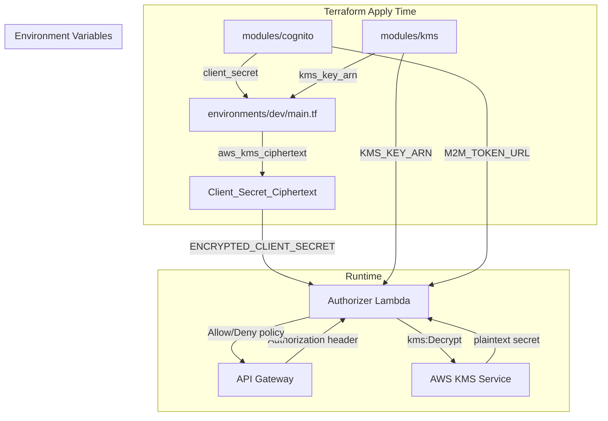

# Design Document: KMS Cognito M2M Auth

## Overview

This design introduces KMS-based encryption for Cognito M2M credentials within the existing Terraform infrastructure. The core change is a new `modules/kms` module that provisions a customer-managed KMS key, which the root environment config uses to encrypt the Cognito client secret at plan/apply time. The encrypted ciphertext (not the plaintext) flows into Lambda environment variables. At runtime, the authorizer Lambda decrypts the secret via boto3's KMS Decrypt API, caching the result in-memory for the lifetime of the execution context.

The Cognito module gains a new `m2m_token_url` output (alongside the existing `token_endpoint`) to make the client_credentials grant endpoint explicit. IAM modules gain optional `kms_key_arn` variables that conditionally attach `kms:Decrypt` inline policies scoped to the specific key ARN.

No hardcoded credentials exist anywhere — all secrets derive from Cognito outputs and are encrypted via KMS before reaching any consumer.

## Architecture



### Data Flow

1. `terraform apply` creates the KMS key and Cognito resources
2. The environment config encrypts `module.cognito.client_secret` using `aws_kms_ciphertext`
3. The ciphertext blob (base64) is passed as `ENCRYPTED_CLIENT_SECRET` env var to the authorizer Lambda
4. At runtime, the Lambda calls `kms:Decrypt` with the ciphertext, caches the plaintext in a module-level variable
5. The plaintext secret is available in-memory only — never persisted

## Components and Interfaces

### New Module: `modules/kms`

A minimal Terraform module that provisions a single symmetric KMS CMK with an alias.

**Variables:**
| Name | Type | Default | Description |
|------|------|---------|-------------|
| `name_prefix` | `string` | `""` | Prefix for the KMS alias (e.g. `dev-`) |
| `alias_name` | `string` | `cognito-secrets` | Suffix for the alias (full: `alias/<prefix><suffix>`) |
| `deletion_window_in_days` | `number` | `30` | Waiting period before key deletion |
| `tags` | `map(string)` | `{}` | Tags applied to KMS resources |

**Outputs:**
| Name | Description |
|------|-------------|
| `key_arn` | ARN of the KMS key |
| `key_id` | ID of the KMS key |
| `alias_arn` | ARN of the KMS alias |

**Resources:**
- `aws_kms_key` — symmetric ENCRYPT_DECRYPT key with automatic rotation enabled
- `aws_kms_alias` — `alias/${var.name_prefix}${var.alias_name}`

### Modified Module: `modules/cognito`

**New Output:**
- `m2m_token_url` — Same URL as `token_endpoint`, with a description specifying `client_credentials` grant usage. The existing `token_endpoint` output is retained for backward compatibility.

### Modified Module: `modules/iam/authorizer`

**New Variable:**
- `kms_key_arn` (optional, `string`, default `""`) — When non-empty, an inline policy granting `kms:Decrypt` on this ARN is attached to the authorizer Lambda role.

**New Resource (conditional):**
- `aws_iam_role_policy.kms_decrypt` — inline policy on `aws_iam_role.lambda`, created only when `kms_key_arn != ""`

### Modified Module: `modules/iam/lambda`

**New Variable:**
- `kms_key_arn` (optional, `string`, default `""`) — Same pattern as iam/authorizer.

**New Resource (conditional):**
- `aws_iam_role_policy.kms_decrypt` — inline policy on `aws_iam_role.this`, created only when `kms_key_arn != ""`

### Modified Module: `modules/authorizer`

**New Variables:**
- `encrypted_client_secret` (`string`, default `""`) — KMS-encrypted client secret ciphertext
- `kms_key_arn` (`string`, default `""`) — KMS key ARN for decryption
- `m2m_token_url` (`string`, default `""`) — M2M token endpoint URL

These are passed through as environment variables on the Lambda resource:
- `ENCRYPTED_CLIENT_SECRET`
- `KMS_KEY_ARN`
- `M2M_TOKEN_URL`

### Modified: `modules/authorizer/handler/index.py`

**New function:** `_decrypt_env(env_var_name: str) -> str`
- Reads the ciphertext from `os.environ[env_var_name]`
- Lazy-imports `boto3` and calls `kms.decrypt(CiphertextBlob=base64.b64decode(ciphertext))`
- Caches the plaintext in a module-level dict `_decrypted_cache`
- On failure, logs the error and raises an exception (which the handler catches and returns Deny)

### Modified: `environments/dev/main.tf`

**New module call:**
```hcl
module "kms" {
  source      = "../../modules/kms"
  name_prefix = "${local.env}-"
  tags        = local.common_tags
}
```

**New data source:**
```hcl
data "aws_kms_ciphertext" "client_secret" {
  key_id    = module.kms.key_id
  plaintext = module.cognito.client_secret
}
```

**Modified module calls:**
- `module.authorizer` gains `encrypted_client_secret`, `kms_key_arn`, `m2m_token_url`
- `module.iam_authorizer` gains `kms_key_arn`
- `module.iam_lambda` gains `kms_key_arn`

**New/modified outputs:**
- `m2m_token_url` — from `module.cognito.m2m_token_url`
- `cognito_client_secret_encrypted` — from `data.aws_kms_ciphertext.client_secret.ciphertext_blob`
- `cognito_client_secret` output is removed (no more plaintext in outputs)

## Data Models

### KMS Key Configuration

```hcl
resource "aws_kms_key" "this" {
  description             = "Encrypts Cognito M2M credentials"
  key_usage               = "ENCRYPT_DECRYPT"
  customer_master_key_spec = "SYMMETRIC_DEFAULT"
  enable_key_rotation     = true
  deletion_window_in_days = var.deletion_window_in_days
  tags                    = var.tags
}
```

### Encrypted Environment Variables Schema

The authorizer Lambda receives these environment variables:

| Variable | Format | Source |
|----------|--------|--------|
| `JWKS_URI` | URL string | `module.cognito.jwks_uri` (existing) |
| `ISSUER` | URL string | `module.cognito.issuer` (existing) |
| `REQUIRED_SCOPE` | scope string | Constructed from vars (existing) |
| `ENCRYPTED_CLIENT_SECRET` | Base64-encoded ciphertext | `data.aws_kms_ciphertext.client_secret.ciphertext_blob` |
| `KMS_KEY_ARN` | ARN string | `module.kms.key_arn` |
| `M2M_TOKEN_URL` | URL string | `module.cognito.m2m_token_url` |

### Decryption Cache Structure (Python runtime)

```python
# Module-level cache — persists across warm invocations
_decrypted_cache: dict[str, str] = {}
```

The cache key is the environment variable name (e.g. `"ENCRYPTED_CLIENT_SECRET"`), and the value is the decrypted plaintext string. The cache is never written to disk or logged.

### IAM Inline Policy Document (KMS Decrypt)

```json
{
  "Version": "2012-10-17",
  "Statement": [{
    "Effect": "Allow",
    "Action": "kms:Decrypt",
    "Resource": "<specific-kms-key-arn>"
  }]
}
```

This policy is scoped to the exact KMS key ARN — never uses `*`.

## Correctness Properties

*A property is a characteristic or behavior that should hold true across all valid executions of a system — essentially, a formal statement about what the system should do. Properties serve as the bridge between human-readable specifications and machine-verifiable correctness guarantees.*

### Property 1: KMS alias naming convention

*For any* `name_prefix` and `alias_name` input strings, the resulting KMS alias name SHALL equal `alias/${name_prefix}${alias_name}`.

**Validates: Requirements 1.2**

### Property 2: Conditional KMS Decrypt policy is scoped to exact key ARN

*For any* IAM module (authorizer or lambda) with a non-empty `kms_key_arn` input, the generated inline policy document SHALL contain `"Action": "kms:Decrypt"` with `"Resource"` set to exactly that `kms_key_arn` value (never `"*"`), and when `kms_key_arn` is empty, no such policy SHALL be created.

**Validates: Requirements 3.2, 3.4, 3.5**

### Property 3: Encrypt-then-decrypt round trip

*For any* plaintext string, encrypting it with the KMS key and then decrypting the resulting ciphertext via `_decrypt_env` SHALL return the original plaintext string.

**Validates: Requirements 2.1, 4.1, 7.4**

### Property 4: Decrypt result caching

*For any* sequence of N calls (N ≥ 2) to `_decrypt_env` with the same environment variable name, the KMS Decrypt API SHALL be invoked exactly once, and all N calls SHALL return the same plaintext value.

**Validates: Requirements 4.2**

### Property 5: KMS failure produces Deny policy

*For any* KMS Decrypt API error (AccessDeniedException, KMSInternalException, KeyUnavailableException, etc.), the authorizer handler SHALL return a policy document with `"Effect": "Deny"`.

**Validates: Requirements 4.3**

### Property 6: M2M token URL format

*For any* Cognito domain prefix and AWS region, the `m2m_token_url` output SHALL equal `https://<domain>.auth.<region>.amazoncognito.com/oauth2/token`.

**Validates: Requirements 5.1**

### Property 7: No hardcoded credentials in source files

*For any* source file (`.py` or `.tf`) in the repository, the file content SHALL not match patterns for hardcoded AWS access keys (`AKIA[0-9A-Z]{16}`), secret keys (40-char base64 strings assigned to credential-named variables), plaintext client secrets, or hardcoded `amazoncognito.com` token URLs in Lambda handler code.

**Validates: Requirements 7.1, 7.2**

## Error Handling

### Terraform Layer

| Scenario | Handling |
|----------|----------|
| KMS key creation fails | Terraform apply fails — no downstream resources are created (dependency graph prevents partial state) |
| `aws_kms_ciphertext` fails | Terraform apply fails before Lambda env vars are set — no broken deployment |
| Cognito client secret is empty | `aws_kms_ciphertext` will encrypt an empty string — the Lambda decrypt path handles this gracefully |

### Lambda Runtime

| Scenario | Handling |
|----------|----------|
| `ENCRYPTED_CLIENT_SECRET` env var missing or empty | `_decrypt_env` returns empty string, no KMS call made |
| KMS Decrypt API returns `AccessDeniedException` | Exception logged, handler returns Deny policy |
| KMS Decrypt API returns `KMSInternalException` | Exception logged, handler returns Deny policy |
| KMS key is pending deletion | `DisabledException` from KMS — logged, Deny policy returned |
| boto3 import fails | ImportError caught, logged, Deny policy returned |
| Ciphertext is corrupted/invalid base64 | `InvalidCiphertextException` from KMS — logged, Deny policy returned |
| Network timeout to KMS endpoint | boto3 raises `EndpointConnectionError` — caught, logged, Deny policy |

### Design Decision: Fail-Closed

The authorizer always fails closed. Any error in the decryption path results in a Deny policy. This is intentional — it's better to reject a valid request than to allow an unauthorized one when the system is in an uncertain state.

## Testing Strategy

### Unit Tests

Unit tests cover specific examples, structural checks, and edge cases:

- **KMS module**: Verify key attributes (symmetric, ENCRYPT_DECRYPT, rotation enabled, default deletion window of 30 days), alias naming with specific prefix values, outputs exist
- **Cognito module**: Verify `m2m_token_url` output exists alongside `token_endpoint`, description mentions `client_credentials`
- **IAM modules**: Verify kms_key_arn variable defaults to empty, policy is created when ARN provided, policy is absent when ARN is empty
- **Authorizer Lambda**:
  - Decrypt returns correct plaintext for a known ciphertext (mocked KMS)
  - Decrypt with empty env var returns empty string without calling KMS
  - Handler returns Deny when KMS throws AccessDeniedException
  - Handler returns Deny when KMS throws KMSInternalException
  - boto3 is not imported when no encrypted env vars are set
- **Environment config**: Verify ciphertext output is non-sensitive, plaintext secret output is removed, m2m_token_url output exists
- **No hardcoded credentials**: Scan all `.py` and `.tf` files for credential patterns

### Property-Based Tests

Property-based tests use `hypothesis` (Python) for the Lambda handler logic and validate universal properties across randomized inputs. Each test runs a minimum of 100 iterations.

| Property | Test Description | Library |
|----------|-----------------|---------|
| Property 1: KMS alias naming | Generate random prefix/alias strings, verify concatenation format | `hypothesis` |
| Property 2: Conditional KMS policy scoping | Generate random ARN strings and empty strings, verify policy presence/absence and Resource field | `hypothesis` |
| Property 3: Encrypt-then-decrypt round trip | Generate random plaintext strings, mock KMS encrypt/decrypt as inverse operations, verify round trip | `hypothesis` |
| Property 4: Decrypt caching | Generate random env var names and call counts (2-10), verify KMS called exactly once | `hypothesis` |
| Property 5: KMS failure → Deny | Generate random KMS exception types, verify handler always returns Deny | `hypothesis` |
| Property 6: M2M token URL format | Generate random domain prefixes and region strings, verify URL pattern | `hypothesis` |
| Property 7: No hardcoded credentials | Generate random file paths from the repo, scan content for credential patterns | `hypothesis` |

Each property test is tagged with a comment:
```python
# Feature: kms-cognito-m2m-auth, Property {N}: {property_text}
```

Property-based tests must NOT implement PBT from scratch — they use the `hypothesis` library. Each correctness property maps to exactly one property-based test.
